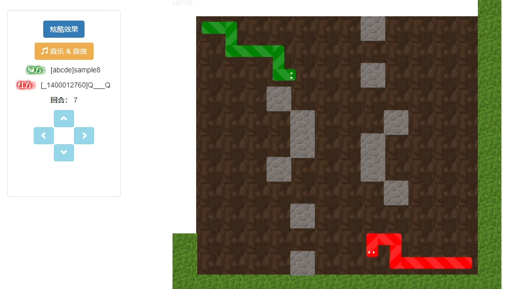

# 联机版贪吃蛇 King of Bots

参考AcWing的SpringBoot项目课程完成开发，项目包含的模块：PK模块：匹配界面（微服务）、实况直播界面（WebSocket协议）、对局列表模块、排行榜模块、用户中心模块；采用前后端分离模式 SpringBoot实现后端 Vue3实现Web端和AcApp端。

## ⭐链接

**项目开源链接**：https://github.com/yuecao0119/KingOfBots

**开发笔记链接**：[联机版贪吃蛇](https://jm5q27wopq.feishu.cn/wiki/KgYywCCt7i7BWpksKiscpIqFnNh)

**参考教程**：[AcWing的SpringBoot框架课](https://www.acwing.com/activity/content/1877/)

## ✈️项目设计

### 技术栈

主要编程语言：Java  前端三大件（HTML/CSS/JavaScript）

对应框架：后端SpringBoot 前端Vue3

开发平台：IntelliJ IDEA 2024.1   Windows 11.0

设计特性：网络通信（WebSocket）、微服务

### 模块设计

项目包含的模块

- PK模块：匹配界面（微服务）、实况直播界面（WebSocket协议）
- 对局列表模块：对局列表界面、对局录像界面
- 排行榜模块：Bot排行榜界面
- 用户中心模块：注册界面、登录界面、我的Bot界面、每个Bot的详情界面

前后端分离模式

- SpringBoot实现后端
- Vue3实现Web端和AcApp端

## 💕预期效果

## 🕊️开发时间表

项目开始于2024年9月，计划在两个星期左右完成，大概开发时间表规划如下：

- [x] 2024年9月2日【初始化】项目初始化，创建前后端框架

- [ ] 2024年9月2日【前端页面】菜单和游戏页面
- [ ] 2024年9月2日【基础功能】登录注册功能实现

## 💻主要贡献者

[@yuecao0119](https://github.com/yuecao0119)